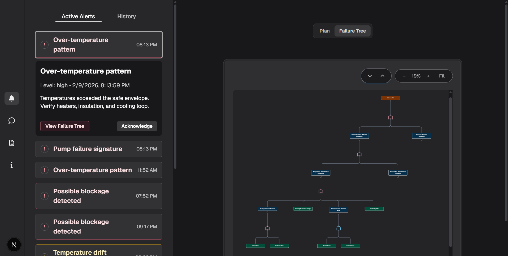

#  AI-Driven Fluid Loop Monitoring, Fault Detection & Diagnosis System

An end-to-end intelligent monitoring and fault diagnosis system built around a **physical fluid loop**.  
This project combines **real-time sensor data acquisition (Arduino)**, **Fault Tree Analysis (FTA)** for explainable diagnosis, a **Decision Tree ML model** for state classification, and an **AI-powered web platform** that turns raw readings into clear dashboards, alerts, and operator-friendly guidance.

**Focus Areas:** Industrial Monitoring • Explainable Diagnosis • Machine Learning • Human-Centered Dashboard Design

---

## ✨ Project Highlights
- ✅ Real-time sensor monitoring (temperature + flow)
- ✅ ML-based classification (Normal / Leak / Blockage / Pump Fault)
- ✅ Explainable root-cause reasoning using FTA
- ✅ Operator dashboard with alerts + actionable steps
- ✅ Interactive failure tree viewer (zoom + fit)
- ✅ AI assistant for troubleshooting support
- ✅ Simulation mode for testing fault scenarios

---

## 🔎 Project Overview
This project demonstrates the design and implementation of an intelligent monitoring system for a physical fluid loop.  
The goal was to combine **real-time sensing**, **explainable fault analysis**, and **machine learning** within a single platform that supports fast and informed operator decision-making.

---

## 🔧 Physical Fluid Loop & Fault Scenarios
A closed-loop fluid system was designed and assembled using a pump, reservoir, valves, and piping.  
To evaluate the system under realistic conditions, controlled fault scenarios were introduced, including **leaks**, **flow blockages**, and **pump-related faults**.

  

---

## 📡 Sensor Data Acquisition (Arduino)
Temperature and flow sensors were connected to an Arduino microcontroller to collect real-time system data.  
Measurements were recorded under both **normal** and **faulty** operating conditions and labeled to support machine learning training.

---

## 🌳 Fault Tree Analysis (FTA)
Fault Tree Analysis (FTA) was used to model failure modes and their causal relationships.  
Detected anomalies in sensor readings were mapped to likely root causes, enabling **explainable diagnosis** instead of black-box anomaly detection.

  

  

---

## 🤖 Machine Learning Model (Decision Tree)
A Decision Tree classifier was trained using the collected sensor data to classify states such as:
- Normal operation  
- Leak  
- Blockage  
- Pump fault  

The model was chosen for its interpretability, allowing predictions to be easily understood and validated.

---

## 🖥️ AI-Powered Monitoring Website

### 🧩 Interactive Fluid Loop Visualization

  

A live visual model of the fluid loop (pipes, valves, tanks, sensors).  
Helps users quickly understand system layout and flow paths.

---

### 🧾 Component Details Panel

  

Clicking a component shows key details (volume, level, material, inspection dates).  
This supports fast checks and easier system understanding.

---

### 📊 Real-Time System Status
The dashboard displays live readings such as:
- **Flow (L/min)**
- **Pressure (kPa)**
- **Temperature (°C)**
- **System status** (Stable / Overheat Risk / Pump Failure)

---

### 🚨 Alerts & Notifications

  

Highlights abnormal behavior such as over-temperature, pump failure, or possible blockages.  
Each alert includes a timestamp + severity to help prioritize actions.

---

### 🌳 Failure Tree Viewer (Explainable Diagnosis)

  

Each alert links to a failure tree view showing possible causes step-by-step.  
Includes zoom controls (in/out + fit) for easy navigation.

---

### 🧠 AI Assistant for Troubleshooting

  

Operators can ask questions like: **“What should I do if I have a leak?”**  
The assistant provides clear troubleshooting steps based on system behavior and sensor patterns.

---

### ▶️ Simulation Mode
Simulation mode allows users to test different fault scenarios and observe how the system responds.  
Useful for demonstrations, training, and validating alert logic.

---

## 🧰 Tech Stack
- **Arduino** (sensor data acquisition)
- **Machine Learning** (Decision Tree classification)
- **Fault Tree Analysis (FTA)**
- **React / Next.js** (frontend)
- **Node.js** (backend)
- **SQLite** (data storage)
- **AI chatbot integration**

---

## 🖼️ Posters

  
  

  
  

---

## ✅ Results
The system successfully demonstrated real-time fault detection and diagnosis.  
Automated alerts and AI-assisted explanations improved transparency and reduced the time required to identify and respond to faults.

---

## 🚀 Limitations & Future Work
- Dataset size was limited due to hardware constraints  
- Future improvements could include:
  - More fault scenarios  
  - Predictive maintenance features  
  - Long-term data logging and trend detection  
  - More sensors for higher accuracy  
