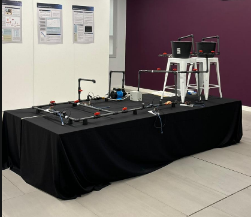
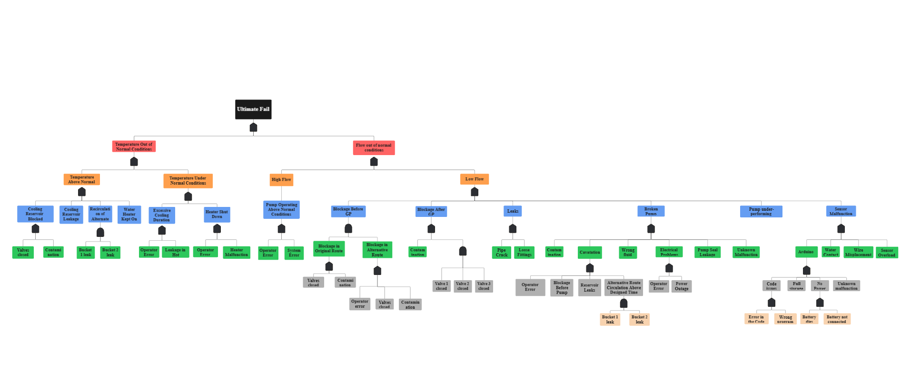
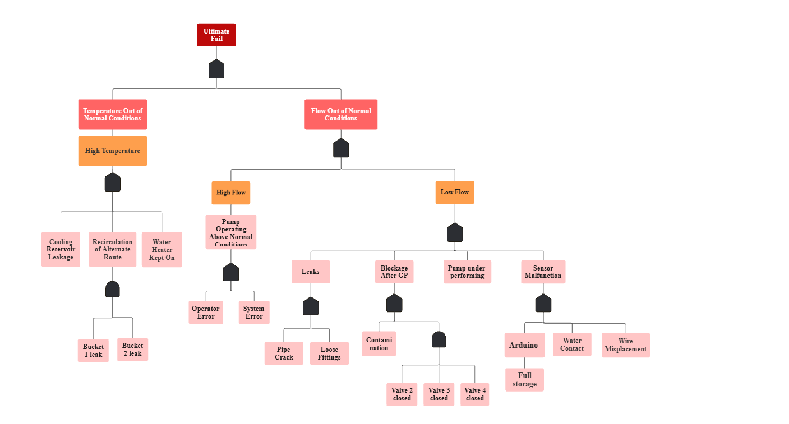
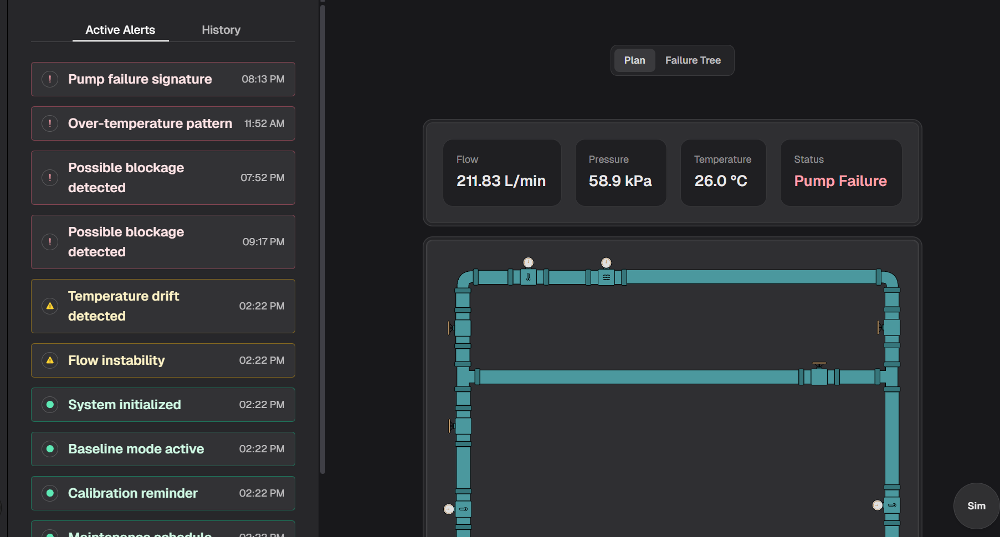
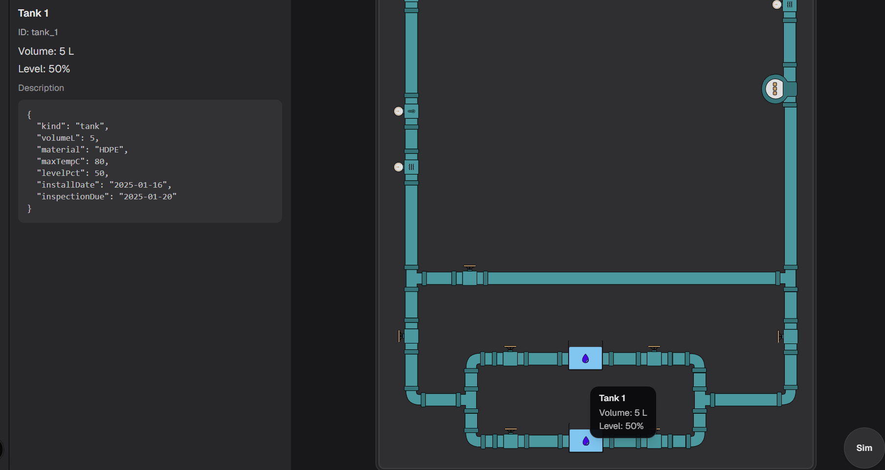
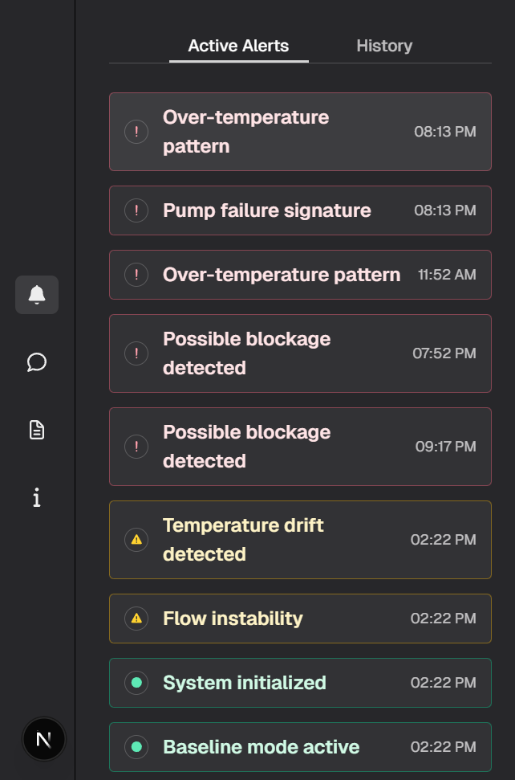
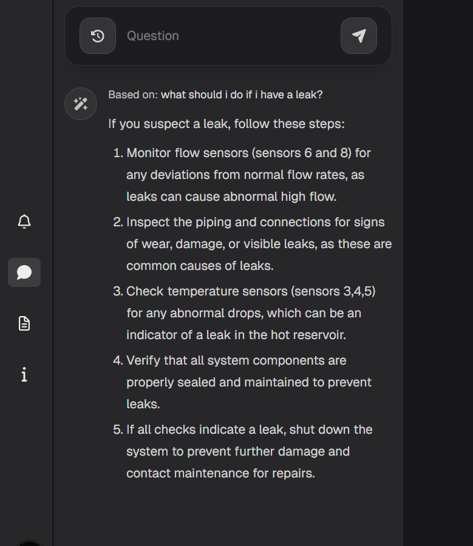
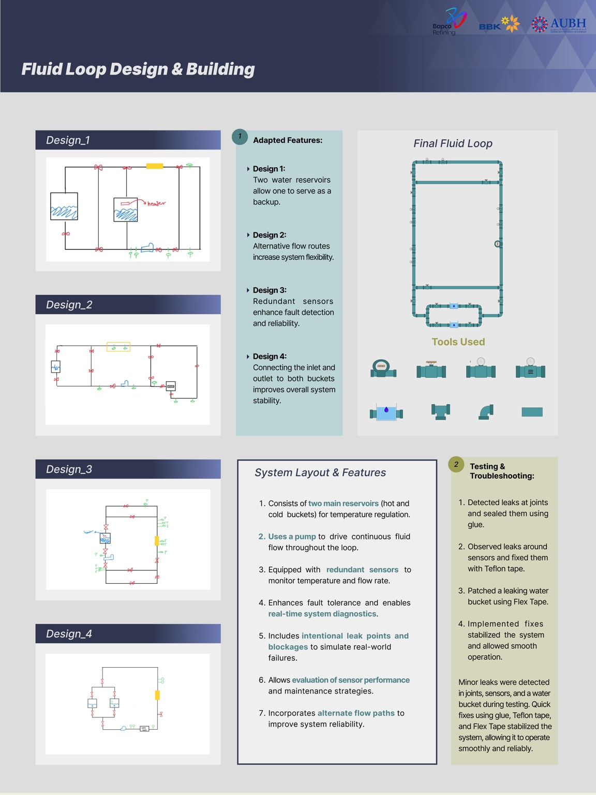
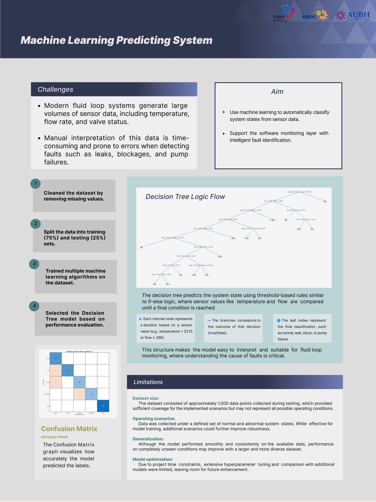
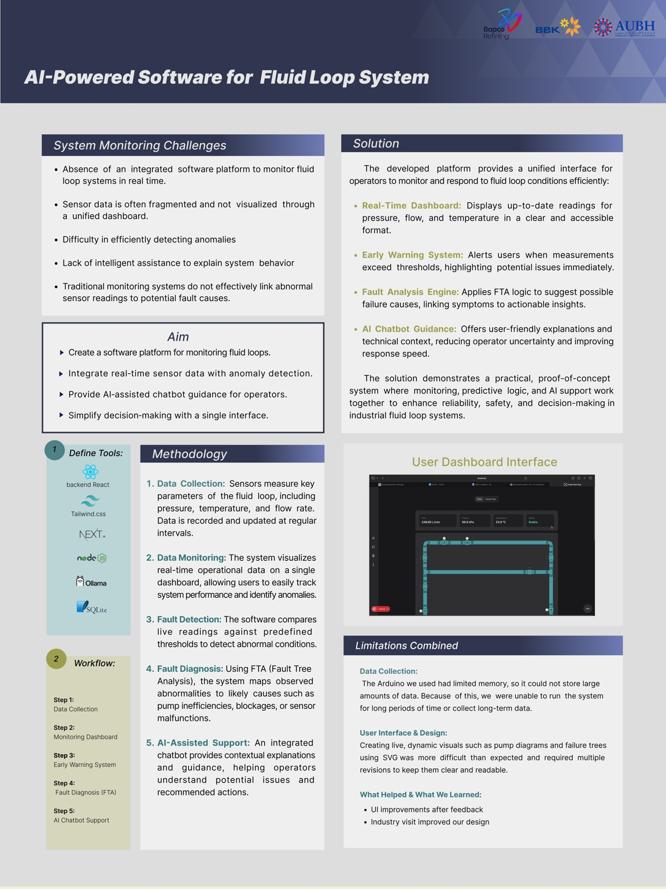

# AI-Driven Fluid Loop Monitoring, Fault Detection & Diagnosis System

An end-to-end intelligent monitoring and fault diagnosis system designed around a physical fluid loop. The project combines real-time sensor data acquisition (Arduino), Fault Tree Analysis (FTA) for explainable root-cause reasoning, machine learning–based state classification, and an AI-powered web platform that turns raw readings into actionable insights through dashboards, alerts, and operator-friendly guidance.

Focus areas: Industrial Monitoring • Explainable Fault Diagnosis • Machine Learning • Human-Centered Dashboard Design

## Project Overview
This project demonstrates the design and implementation of an intelligent monitoring system for a physical fluid loop. The goal was to combine real-time sensing, explainable fault analysis, and machine learning within a single platform that supports fast and informed operator decision-making.

## Physical Fluid Loop & Fault Scenarios
A closed-loop fluid system was designed and assembled using a pump, reservoir, valves, and piping. To evaluate system behavior under realistic conditions, controlled fault scenarios were introduced, including leaks, flow blockages, and pump-related faults. These scenarios provided the foundation for testing monitoring and diagnostic strategies.

## Sensor Data Acquisition (Arduino)
Temperature and flow sensors were connected to an Arduino microcontroller to collect real-time system data. Measurements were recorded under both normal and faulty operating conditions and labeled accordingly to support analysis and machine learning model training.

## Fault Tree Analysis (FTA)
Fault Tree Analysis (FTA) was used to model potential failure modes and their causal relationships. Detected anomalies in sensor readings were mapped to likely root causes, enabling explainable fault diagnosis rather than black-box anomaly detection.

## Machine Learning Model (Decision Tree)
A decision tree classifier was trained using the collected sensor data to classify system states such as normal operation, leaks, blockages, and pump faults. The model was selected for its interpretability, allowing predictions to be easily understood and validated.

## AI-Powered Monitoring Website

### 🧩 Interactive Fluid Loop Visualization

This view shows a live visual model of the fluid loop, including pipes, valves, tanks, and sensors.  
It helps users clearly understand how the system is connected and how fluid flows through it.

---

### 🧾 Component Details Panel

When a component such as a tank is selected, its basic information is displayed, including volume, level, material, and inspection dates.  
This allows operators to quickly understand the condition and properties of each system component.

---

### 📊 Real-Time System Status

The dashboard displays live system readings such as flow rate, pressure, and temperature.  
It also shows the overall system status (stable, overheat risk, or failure) to support fast decision-making.

---

### 🚨 Alerts & Notifications

The alerts panel highlights abnormal system behavior such as over-temperature, pump failure, or possible blockages.  
Each alert includes a timestamp and severity level to help users prioritize issues.

---

### 🌳 Failure Tree Analysis

Each alert is linked to a failure tree view that explains possible causes step by step.  
This helps users understand why a problem occurred instead of only seeing the alert.

---

### 🧠 AI Assistant for Troubleshooting

The built-in assistant allows users to ask questions like “What should I do if there is a leak?”.  
The system responds with clear troubleshooting steps based on sensor data and system behavior.

---

### ▶️ Simulation Mode

Simulation mode allows users to test different fault scenarios and observe how the system responds.  
This makes the platform useful for training, demonstrations, and system analysis.

## Tech Stack
- Arduino (sensor data acquisition)
- Machine Learning (Decision Tree classification)
- Fault Tree Analysis (FTA)
- React / Next.js (frontend)
- Node.js (backend)
- SQLite (data storage)
- AI Chatbot integration

## Posters

## Results
The system successfully demonstrated real-time fault detection and diagnosis. Automated alerts and AI-assisted explanations improved system transparency and reduced the time required to identify and respond to faults.

## Limitations & Future Work
The dataset size was limited due to hardware constraints. Future work could include additional fault scenarios, predictive maintenance capabilities, and long-term data logging to further enhance system performance.
